<div align="center">
  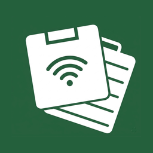
  <h1>ClipSync</h1>
  <p>Real-time clipboard sync between macOS and Android — over LAN or Tailscale.</p>
</div>

---

## What it does

- **Text, bidirectional** — copy text on the Mac and it lands in the Android clipboard instantly, and vice versa.
- **Images from Mac to Android** — copy an image or screenshot on the Mac (⌘+Ctrl+Shift+4) and it appears in the Android clipboard, ready to paste anywhere.
- **Screenshots, bidirectional** — take a screenshot on Android and it is sent to the Mac clipboard automatically. Take one on the Mac and it goes to Android.
- **Share to Mac** — a "Mac" button appears in the Android share sheet. Tap it to send any file or photo directly to the Mac; it is saved in `Documents/ClipSync/` and copied to the Mac clipboard.

---

## Features

- **Auto-discovery** — mDNS/Bonjour on LAN; manual IP for Tailscale
- **Secure channel** — self-signed TLS with SPKI fingerprint pinning (TOFU)
- **Authenticated payloads** — Bearer token + HMAC-SHA256 on every request
- **Persistent connection** — Android foreground service with automatic reconnection
- **Neumorphic UI** — clean dark/light Android interface
- **Tailscale support** — works over WireGuard tunnels when away from home

### In the code but not currently surfaced

- **Floating FAB overlay** (`ClipOverlayManager`) — a persistent bubble that floats over any Android app and pushes the clipboard to the Mac on tap. The implementation is complete but disabled in the current UI; it can be re-enabled.

---

## Screenshots

### macOS

<table>
  <tr>
    <td align="center">
      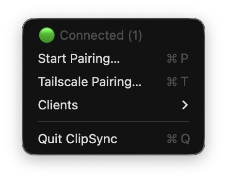<br/>
      <sub>Menu bar</sub>
    </td>
    <td align="center">
      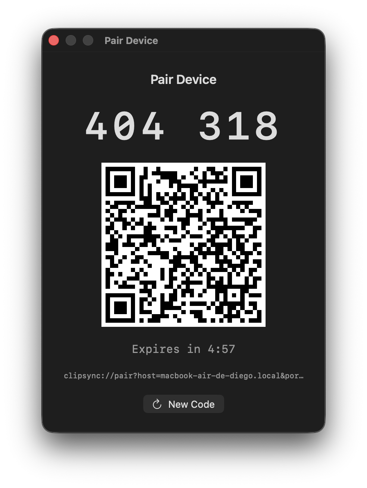<br/>
      <sub>Pair Device</sub>
    </td>
    <td align="center">
      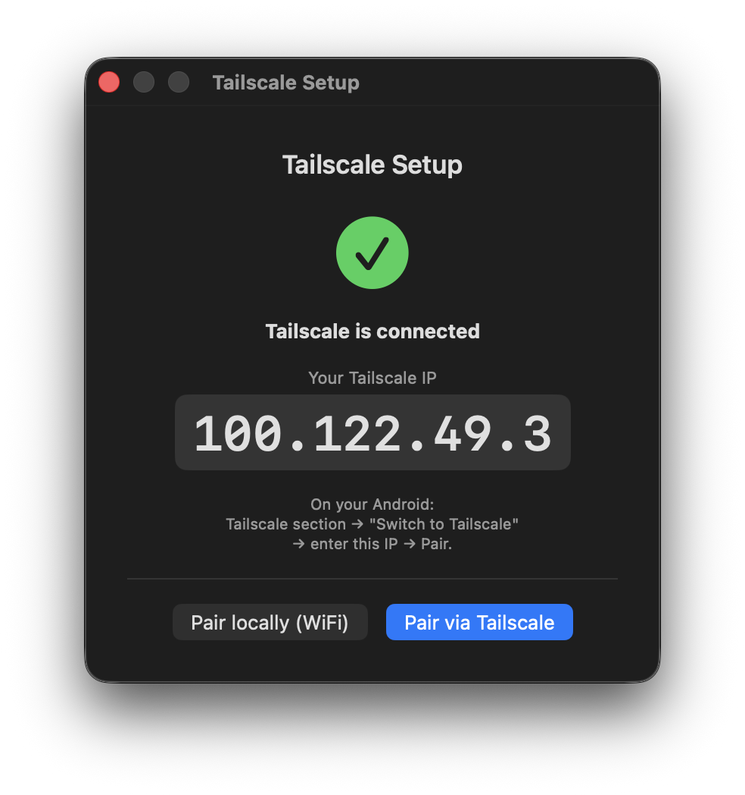<br/>
      <sub>Tailscale connected</sub>
    </td>
    <td align="center">
      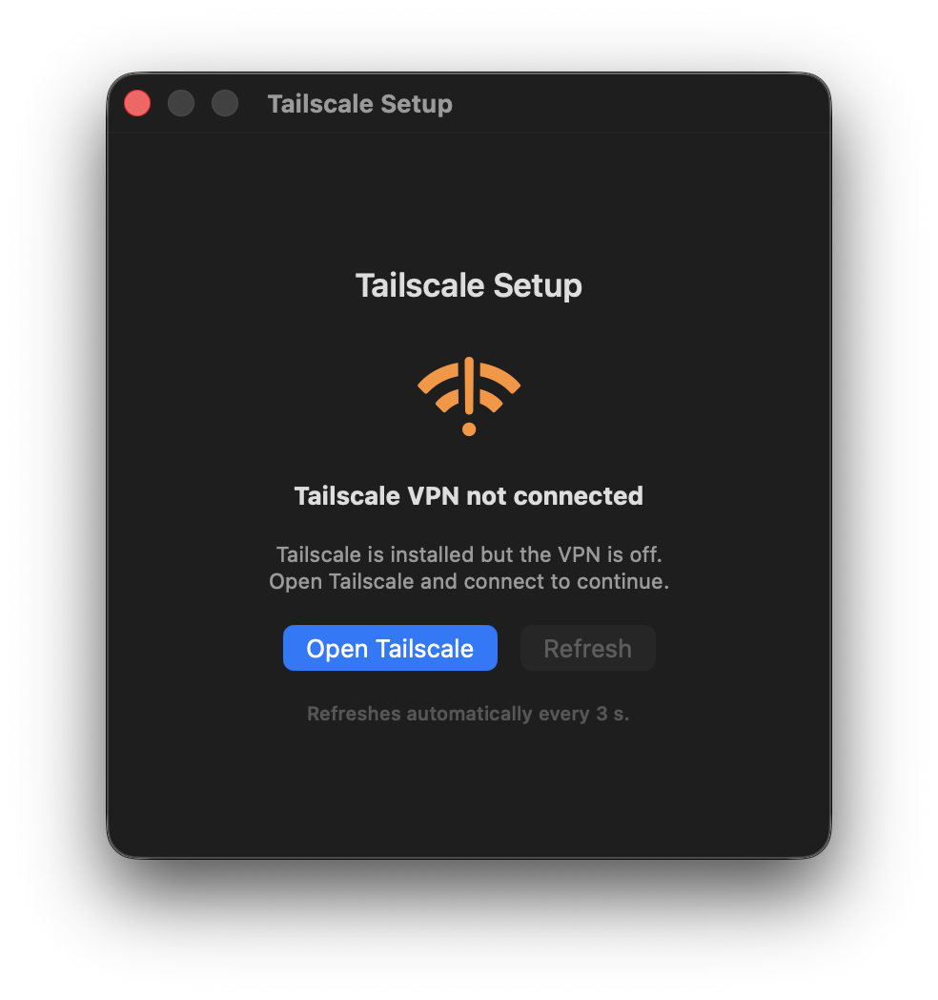<br/>
      <sub>Tailscale VPN off</sub>
    </td>
  </tr>
</table>

### Android — WiFi (LAN auto-discovery)

<table>
  <tr>
    <td align="center">
      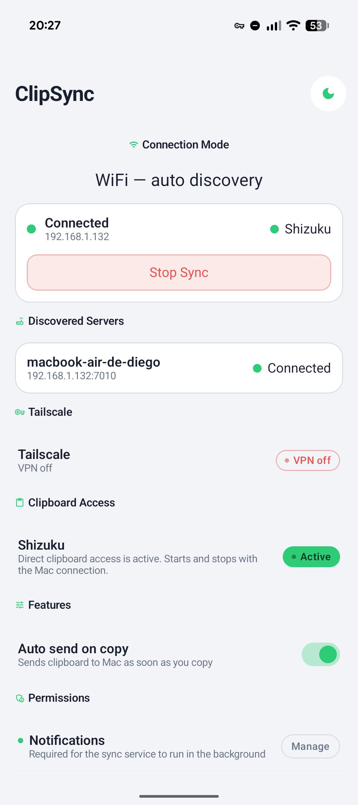<br/>
      <sub>Light mode</sub>
    </td>
    <td align="center">
      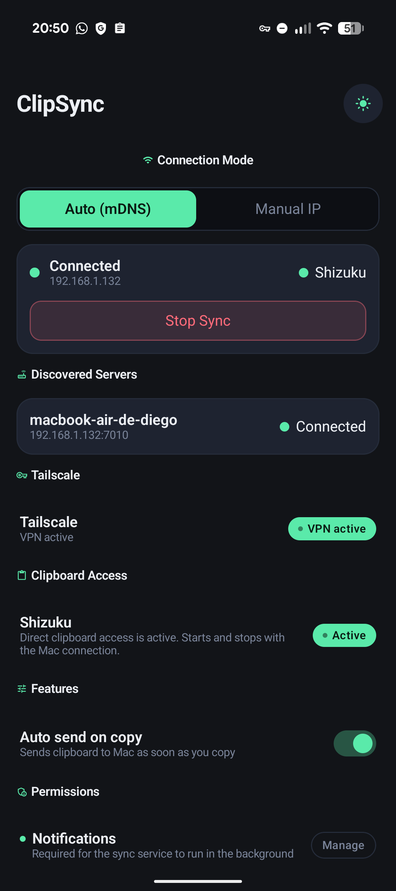<br/>
      <sub>Dark mode</sub>
    </td>
  </tr>
</table>

### Android — Tailscale (VPN, manual IP)

<table>
  <tr>
    <td align="center">
      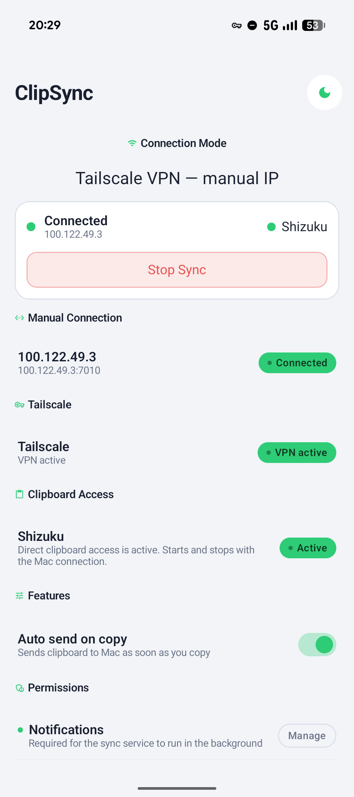<br/>
      <sub>Connected — light</sub>
    </td>
    <td align="center">
      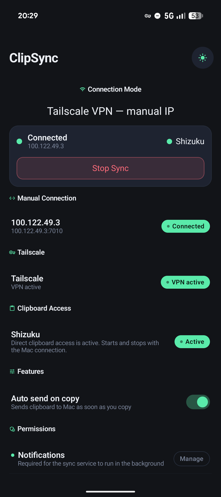<br/>
      <sub>Connected — dark</sub>
    </td>
    <td align="center">
      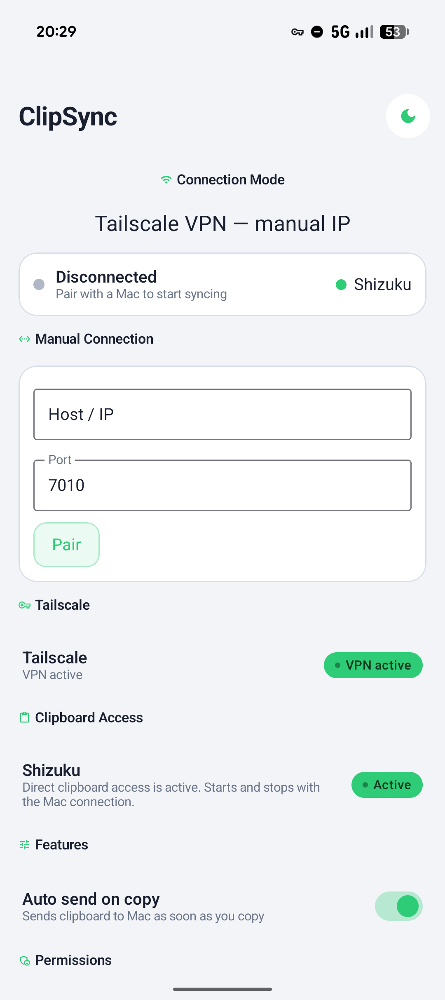<br/>
      <sub>Manual IP — light</sub>
    </td>
    <td align="center">
      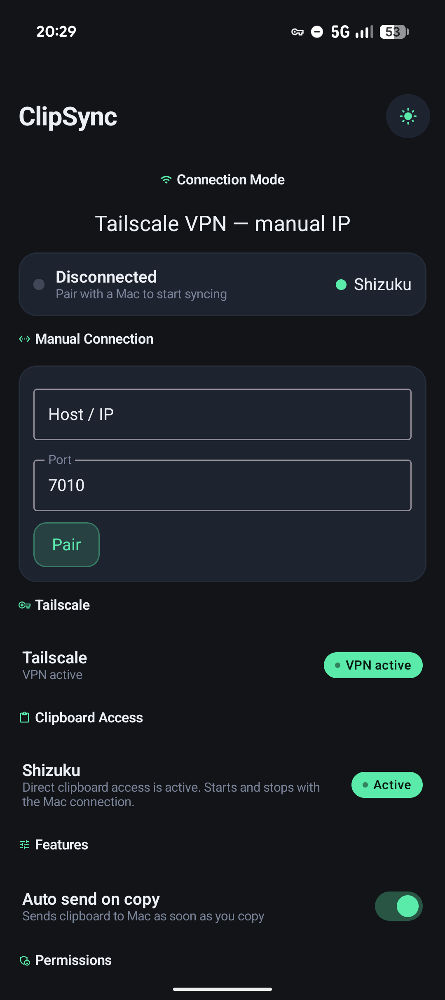<br/>
      <sub>Manual IP — dark</sub>
    </td>
  </tr>
</table>

---

## How it works

### Pairing — one time setup

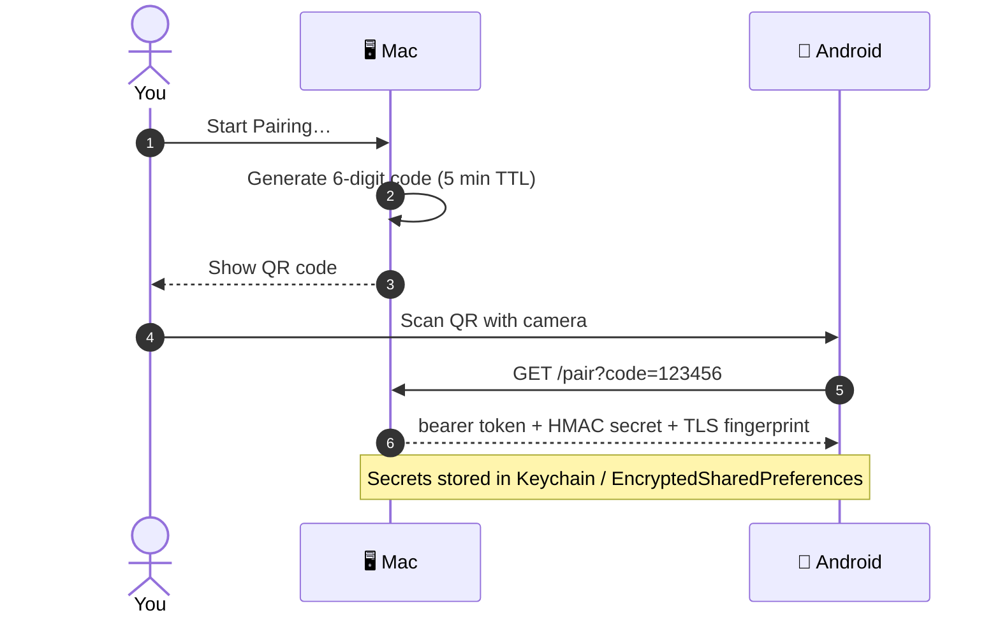

### Clipboard sync — every copy

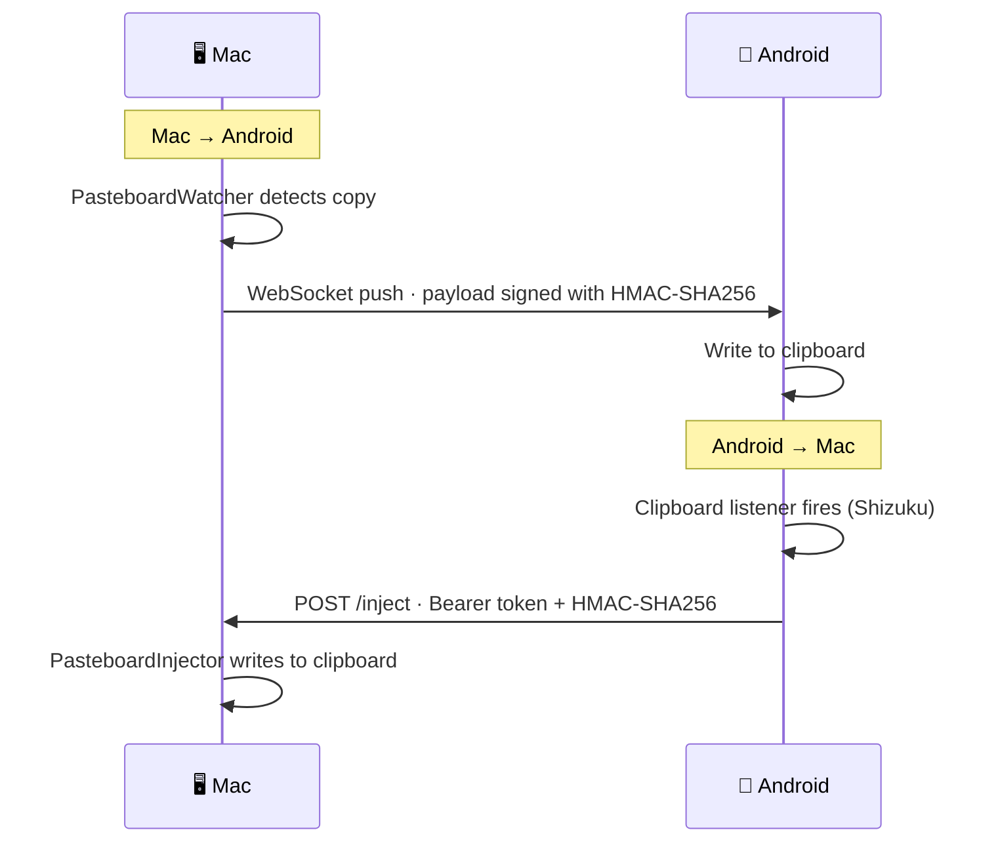

> **Transport:** TLS with SPKI pinning (TOFU) — LAN via mDNS · remote via Tailscale IP

---

## Requirements

| Platform | Minimum    | Tested with         |
|----------|-----------|---------------------|
| macOS    | 14.0      | Xcode 26, Swift 5.9 |
| Android  | 13 (API 33)| AGP 8.x, Kotlin 1.9 |

---

## Quick start

See **[docs/installation.md](docs/installation.md)** for the full guide, including code-signing setup, Shizuku (for auto clipboard read), and Tailscale.

**macOS — build & run**

```bash
# 1. Set up code signing (one-time)
bash mac/scripts/setup-signing.sh

# 2. Build
xcodebuild \
  -project mac/ClipSync.xcodeproj \
  -scheme ClipSync \
  -configuration Debug \
  -derivedDataPath mac/build \
  build

# 3. Launch
open mac/build/Build/Products/Debug/ClipSync.app
```

**Android — build APK**

```bash
cd android
./gradlew assembleDebug
# APK: android/app/build/outputs/apk/debug/app-debug.apk
```

Sideload the APK via `adb install` or transfer to the device.

---

## Repository structure

```
clip-sync/
├── mac/                          macOS Swift app (Xcode project)
│   ├── ClipSync/                 source code (17 Swift files)
│   ├── ClipSyncTests/            unit tests (35 tests)
│   └── scripts/
│       ├── setup-signing.sh      code-signing helper
│       └── build-release.sh      release build
├── android/                      Android Kotlin app
│   └── app/src/main/java/
│       └── com/clipsync/         source code (22 Kotlin files)
└── docs/
    ├── installation.md           full setup guide ← start here
    ├── screenshots/              UI screenshots
    ├── architecture/
    │   ├── protocol.md           wire protocol reference
    │   ├── security.md           security model
    │   ├── threat-model.md       threat model
    │   └── analisis-tecnico-profundo.pdf  deep analysis (Gemini)
    ├── guides/
    │   └── tailscale-setup.md    Tailscale-specific guide
    ├── development/
    │   └── TODO.md, plans, HANDOFF
    └── phases/
        └── phase-{1-9}-summary.md  development pipeline history
```

---

## Security

ClipSync is designed for use on trusted networks or a private Tailscale tailnet. It is **not** intended for public internet exposure.

- TLS with self-signed certificate; SPKI fingerprint pinned on first connect (TOFU)
- Every request carries a Bearer token and an HMAC-SHA256 of the payload body
- Timestamps validated within ±60 s to prevent replay attacks
- Secrets stored in macOS Keychain and Android EncryptedSharedPreferences

See [docs/architecture/security.md](docs/architecture/security.md) for the full security model.

---

## Deep technical analysis

[docs/architecture/analisis-tecnico-profundo.pdf](docs/architecture/analisis-tecnico-profundo.pdf) (also available as [Markdown](docs/architecture/analisis-tecnico-profundo.md)) is a detailed technical document covering every layer of ClipSync — discovery, pairing, TLS, HMAC, secret storage, Android clipboard restrictions, full data flows, and the threat model.

It was produced by feeding the entire v0.1.0 source code to **Gemini Deep Research** with a structured prompt asking it to explain the system top-to-bottom, compare each design decision against the alternatives that were rejected, and evaluate the honest trade-offs of each choice. The document is written in Spanish and is aimed at a reader with a solid technical background who wants to understand not just *what* the code does but *why* each decision was made.

---

## Known limitations

- mDNS auto-discovery does not work over Tailscale (no multicast in WireGuard). Use manual IP entry with the Mac's Tailscale IP (`100.x.x.x`).
- Clipboard auto-send on Android requires Shizuku or an Accessibility Service (see [installation guide](docs/installation.md#4-shizuku--automatic-clipboard-reading)).
- Code signing and Gatekeeper notarization are not configured for distribution.

---

## Contributing

Issues and improvement suggestions are welcome — feel free to [open one](https://github.com/2cristo7/clip-sync/issues).

---

## License

MIT — see [LICENSE](LICENSE).
